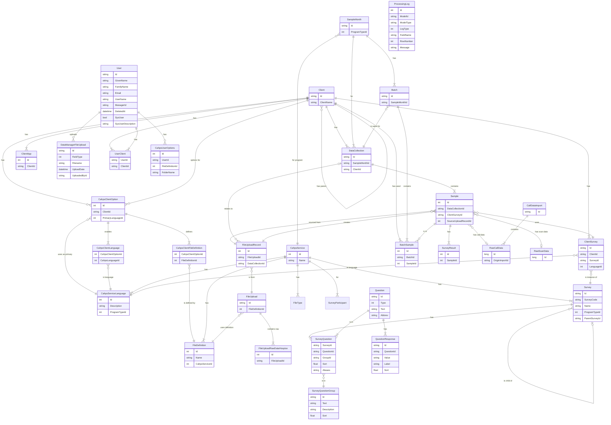

```mermaid
erDiagram
Client {
string Id
string ClientName
}
CahpsClientOption {
int Id
string ClientId
int PrimaryLanguageId
}
CahpsServiceLanguage {
int Id
string Description
int ProgramTypeId
}
CahpsClientFileDefinition {
int CahpsClientOptionId
int FileDefinitionId
}
CahpsClientLanguage {
int CahpsClientOptionId
int CahpsLanguageId
}
FileDefinition {
int Id
string Name
int CahpsServiceId
}
CahpsService {
int Id
string Name
}
SampleMonth {
string Id
int ProgramTypeId
}
Batch {
string Id
string SampleMonthId
}
DataCollection {
string Id
string SampleMonthId
string ClientId
}
Sample {
int Id
string DataCollectionId
string ClientSurveyId
int SourceUploadRecordId
}
ClientSurvey {
string Id
string ClientId
string SurveyId
int LanguageId
}
FileUploadRecord {
int Id
string FileUploadId
string DataCollectionId
}
FileUpload {
string Id
int FileDefinitionId
}
FileUploadRawDataHospice {
int Id
string FileUploadId
}
BatchSample {
int Id
string BatchId
int SampleId
}
SurveyResult {
int Id
int SampleId
}
CallDataImport {
string Id
}
RawCallData {
long Id
string OriginImportId
}
RawScanData {
long Id
}
ClientApp {
int Id
string ClientId
}
DataManagerFileUpload {
string Id
int FieldType
string Filename
datetime UploadDate
string UploadedById
}
ProcessingLog {
int Id
string ModelId
string ModelType
int LogType
string FieldName
int RowNumber
string Message
}
User {
string Id
string GivenName
string FamilyName
string Email
string UserName
string ManagerId
datetime DeletedAt
bool SysUser
string SysUserDescription
}
UserClient {
string UserId
string ClientId
}
Survey {
string Id
string SurveyCode
string Name
int ProgramTypeId
string ParentSurveyId
}
Question {
string Id
int Type
string Text
string Abbrev
}
SurveyQuestion {
string SurveyId
string QuestionId
string GroupId
float Sort
string Aliases
}
SurveyQuestionGroup {
string Id
string Text
string Description
float Sort
}
QuestionResponse {
string Id
string QuestionId
string Value
string Label
float Sort
}
CahpsUserOptions {
int Id
string UserId
int FileDefinitionId
string FolderName
}

    Client ||--|{ ClientApp : "has"
    Client ||--o{ CahpsClientOption : "has"
    Client ||--|{ ClientSurvey : "has"
    Client ||--|{ DataCollection : "has"
    Client }o--|| Client : "has parent"
    Client ||--|{ BatchSample : "has seed"
    Client ||--|{ UserClient : "has"

    CahpsClientOption ||--|{ CahpsClientFileDefinition : "defines"
    CahpsClientOption ||--|{ CahpsClientLanguage : "enables"
    CahpsClientOption }o--|| CahpsServiceLanguage : "uses as primary"
    CahpsClientOption }o--|| Client : "options for"

    CahpsClientFileDefinition }o--|| FileDefinition : "is defined by"
    CahpsClientLanguage }o--|| CahpsServiceLanguage : "is language"

    CahpsService ||--|{ FileDefinition : "has"
    CahpsService ||--|{ FileType : "has"
    CahpsService ||--|{ CahpsServiceLanguage : "has"
    CahpsService ||--|{ SurveyParticipant : "for"
    CahpsService ||--|{ Survey : "has"

    SampleMonth ||--|{ Batch : "has"
    SampleMonth ||--|{ DataCollection : "for"
    SampleMonth }o--|| CahpsService : "for program"

    Batch ||--|{ BatchSample : "contains"
    Batch }o--|| DataCollection : "is wave for"

    DataCollection ||--|{ Sample : "contains"

    Sample ||--|{ SurveyResult : "has"
    Sample }o--|| ClientSurvey : "uses"
    Sample }o--|| FileUploadRecord : "sourced from"
    Sample }o--o| RawScanData : "has scan data"
    Sample }o--o| RawCallData : "has call data"
    Sample ||--o{ BatchSample : "is in"

    FileUploadRecord }o--|| FileUpload : "is from"
    FileUploadRecord }o--o| DataCollection : "relates to"
    FileUploadRecord ||--o{ Sample : "creates"

    FileUpload ||--|{ FileUploadRawDataHospice : "contains raw"
    FileUpload }o--|| FileDefinition : "uses definition"

    CallDataImport ||--|{ RawCallData : "contains"

    ClientSurvey }o--|| CahpsServiceLanguage : "in language"
    ClientSurvey }o--|| Survey : "is instance of"

    User ||--|{ UserClient : "has"
    User ||--o{ DataManagerFileUpload : "uploads"
    User ||--o{ CahpsUserOptions : "has"

    Survey ||--|{ SurveyQuestion : "has"
    Survey }o--o| Survey : "is child of"

    Question ||--|{ SurveyQuestion : "is in"
    Question ||--|{ QuestionResponse : "has"

    SurveyQuestion }o--|| SurveyQuestionGroup : "is in"
```
***AI Generated***
Roo Prompt: Create a mermaid diagram using the @/Models directory and @/Data/CahpsContext.cs